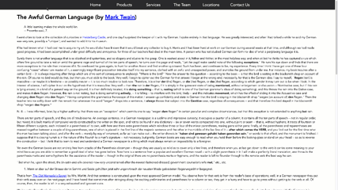

# Accessible ~Mega Menu~ Navigation Example

## What this is
This is a fully functioning example of a navigation menu, which operates properly for both mouse users and keyboard users.

*Important!!!* One of the things that many people misunderstand (largely due to nomenclature confusion) is that a large grouping of navigation links is not the same as a [_menu_](https://www.w3.org/TR/wai-aria-practices-1.1/#menu) in an application. There is a huge and important difference between a grouping of links that provide navigation (which initiates a change of context) and a menu which operates in the context of an application. In the overwhelming majority of cases, what most people refer to as a "menu" is really navigation. That is what this repository demonstrates.

### Accessibility Requirements 

The core requirements for navigation like this are:

1. The markup structure of the navigation must make sense. Because this is a list of links, it needs to be structured as an HTML list.
1. The top-level options, when activated, should go to a proper destination - the "landing page" for that section of content, if you will.
1. When the parent option receives hover *or* focus events, its sub-options should show. In other words, the interaction for both mouse users and keyboard users should be the same. 
1. The focus order through the navigational options should follow the logical structure of the navigation.
1. As things in the menu get focus, the visual style of the focused item should be clearly and obviously different from those items that do not have focus.  That _same exact_ visual style should be used on hover as well.

## Try it out

Fork/ clone this repo. Then, open `index.html` and interact with the global navigation at the top of the page. 

1. Use only the `Tab` key to move forward through the entire navigation. Observe the way that the sub-options show when the parent items get focus. Observe the way that focus follows naturally and logically from the parent option, to & through the sub-options under it. As focus leaves the last item in the list, focus arrives on the next parent option and opens its sub-options.
1. Use only the `Shift+Tab` key combination and note that it operates in the exact reverse of the above.

## How to use the code

This really isn't meant to be a plug-n-play example. Chances are, your own implementation will need some customization. Use the HTML, CSS, and JS in this repo as inspiration for your own thing. 